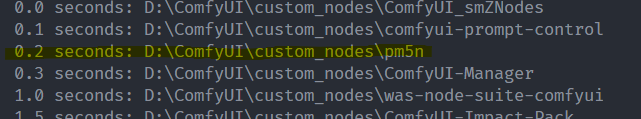
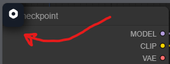
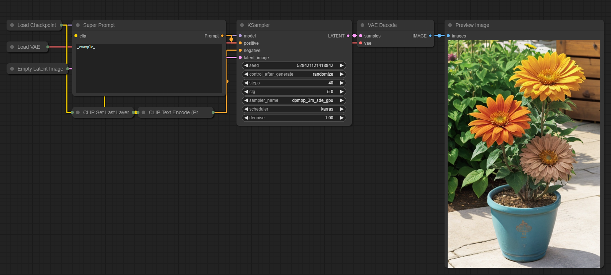
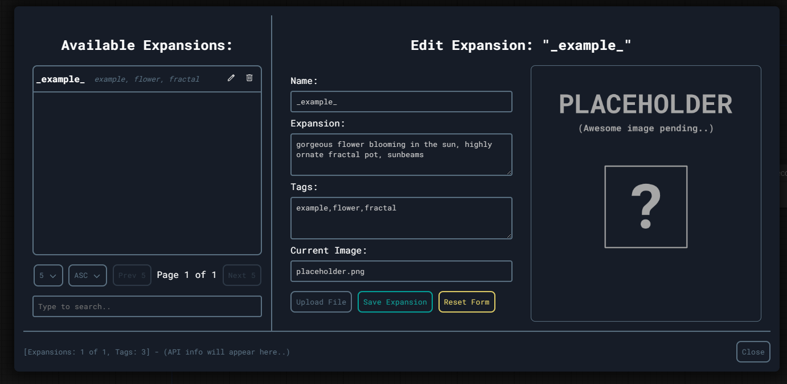
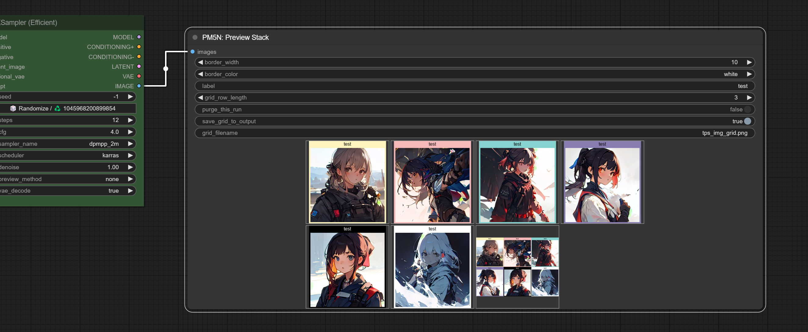

# PM5N - PM5K's Nodes

This is a custom node library for the Stable Diffusion UI known as [ComfyUI](https://github.com/comfyanonymous/ComfyUI).

The goal of this library is to both open source behaviours I wanted for myself and to provide some form of well-documented library spanning the backend and UI to serve as a guide for folks who may want to develop their own, but find it a little daunting to unpick a fast-moving repo or extension source code.

# Functionality Glossary

1. Prompt expansions
   - Node component
   - Custom management UI using a database and a reactive UI
2. Preview Stack

# Installation Instructions

## ComfyUI Manager

[Coming Soon]

## Prerequisites

It is assumed you will have ComfyUI set up already, if not - go [here](https://github.com/comfyanonymous/ComfyUI) and set it up using the instructions in the README.

1. Activate your virtual environment for ComfyUI. This can be done by opening your shell (PowerShell, Bash, Zsh..) and changing directories (`cd` command) to the root folder of ComfyUI.

   Example for Windows using a fully qualified path: `cd D:\ComfyUI` then `.\venv\Scripts\Activate.ps1` if using PowerShell or if using CMD (please let it die..) - `.\venv\Scripts\activate.bat`.

2. Once the environment is active, you can proceed to installation!

## Installing via simple git clone

Continuing on from the above, now that you're in the virtual environment..
(For brevity linux users are assumed to adapt the below to their shell).

3. You must now change directories - `cd .\custom_nodes\`
4. Clone this repository in one of two ways:

   4.a (HTTPS): `git clone https://github.com/pm5k/pm5n.git`

   4.b (SSH): `git clone git@github.com:pm5k/pm5n.git`

5. Now change dir once more into the cloned repo via - ```cd pm5n``` and install the requirements for this extension using this command - ```pip install -r requirements.txt```.

6. Once installation completes, simply go back to the ComfyUI root and run comfy the way you normally do.

**TIP**: You can specifiy the IP/Port Comfy is exposed on by launching it like so: `python main.py --listen=<IP_ADDR> --port=<PORT>`

You will know everything has worked if you see your terminal output show:



And if in your comfy UI you notice a new component floating in the top-left of your screen:



# Feature Breakdown

## Prompt Expansions

Prompt expansions allow you to create pre-set sub-prompts which can be triggered by using assigned keywords to make it easier to compose various cool prompts. I had need to organise combinations of prompt pieces for myself and make the measily searchable, while [AloeVera](https://github.com/PurpleBlueAloeVera) (a co-founder of UNVAIL-AI) already had prompt expansions in Auto1111's UI as it's own extension. So I asked if I could meld it all into one tidy ComfyUI extension and the rest is history..

This node/behaviour consists of two layers - a custom node called `Super Prompt` found in the right-click menu under `Add Node > pm5n > Super Prompt`, and a custom user interface which allows you to manage these expansions so you can focus on doing it all inside of ComfyUI rather than working with JSON or YAML files and worrying about syntax or fiddly nuances.

So for instance, instead of typing up `.. a beautiful flower in a ornate fractal pot` into the prompt, you can assign it to the `flower_ornate` trigger and only enter the trigger in the prompt field for your KSampler or anything else that takes in `CONDITIONING` to receive the expanded text!

Here it is in action:



And here's how it looks in the UI:



And of course - you can take the output and upload it to serve as the thumbnail of this expansion, letting you easily remind yourself of what the output could look like!

Lastly - there are no restrictions on how you name your expansions (to be fair I have not tested every permutation), the only thing to be aware of is that you should treat these as proper tokens. This means that the `expansion` field should look like `a cat, sitting on a tree` not `a cat, sitting on a tree,` since you are going to add that trailing comma in the prompt, so the node will respect this. You can also merge in embeddings like so - `a cat, embedding:tabbycatsgalore, sitting in a tree, looking wise`. It will work just fine. Basically treat that field as a sub-prompt for a single large token and you will be fine.

To read about all this in detail, please consider checking out the [expansion readme](__resources__/EXPANSIONS.md).

## Preview Stack



The preview stack allows you to continuously queue up your workflow as you make changes,
without destroying the previously generated preview image.

The goal is to allow folks to easily keep comparative score of their progress in the workflow tweaks. To that end, this node allows for the following:

1.  **Labelling images:** you can set a label manually or as per the example, introduce an automated and more complex labelling solution. Keep in mind that text beyon a certain width will end up truncated. I have not bothered to introduce wrapping auto-expanding label areas and text wrap. Keep it short and sweet for now.

2.  **Adding a border:** you can specify a border width in pixel units to go around an image. If set to 0 - there will be no border. 0 also disables the labelling functionality.

3.  **Choosing a border color:** you may choose to provide a color for your border, currently this is mapped to a palette, hence the drop-down. The palette is shown in it's entirety in the example image.
    The names of the colors are simply:

        ```py
        # Nice calming pastel palette..
        palette_map = {
            "white": (255, 255, 255),
            "black": (0, 0, 0),
            "yellow": (255, 244, 189),
            "red": (244, 185, 184),
            "blue": (133, 210, 208),
            "purple": (136, 123, 176),
        }
        ```
        So if you are attempting to feed the node with some random colorisation, make sure you don't pick from more strings than shown above. Otherwise the color mapping will raise an error.

4.  **Purging the stack:** sometimes you will notice that the preview node will fill up with a huge amount of images as you work. There's a boolean toggle switch which will clear all of them the next time you generate something, thus resetting your grid to it's initial state. **Just remember to turn that toggle off after your grid clears and the initial first image is generated, or else you will only ever generate one image as with a normal preview node.**

**Caveats:**

- The stacking preview was made such that the front-end of Comfy deals with how the imagery is placed for the user. After all - the preview node already stacks stuff in boxes for batches of two or more. However, even though the stack images are numbered in sequence (99,999 images before the sequence resets) - sometimes they get auto-sized in weird ways. Just adjust the preview node until it looks alright-ish.
- Changing sizes of your latent during generation is totally fine, but expect to see the Comfy UI handle this as best it can (rules of HTML and CSS) and still come out weird. Nothing you can really do outside of fiddling with the base css rulesets, which is out of scope for this node.
- This node follows ComyUI's optimisation principles - if nothing significant changed in the output (generated image filename, input params for the node, other data used by the node) you may see the same image being shown to you. Adjust your params and it will work just fine.
- I have removed metadata saving to these images for the time bein, it can be reintroduced on request.

# Technical Information

For those curious about how to make an extension of their very own, I have tried to document the code as much as possible so you could follow along and will continue to do so during the cleanup / refactor phases so you could follow along and make your own extension. This is not to say that you will not need ANY technical knowledge (you will), but some aspects of Comfy are not always well-documented, and extension dev being a rapidly moving environment means that the focus of developers is to ship rather than waste time over-beautifying the codebase or "yak shaving". (Also who writes perfect code anyway? :P)

## Backend

The backend is pretty vanilla, it consists of two main files and a supporting database submodule.

- `__init__.py` is responsible for registering the extension and setting up the node as well as handling database bootstrap.
- `api.py` is simply a way to separate the custom API endpoints we want to use in our extension. These deal with request handling from our UI as well as work with our database.
- `database/` is a submodule for [sqlalchemy](https://www.sqlalchemy.org/) which defines the database (sqlite in this case), db objects, relationships, utility functins and [Pydantic](https://docs.pydantic.dev/latest/) serialisers.

**Note:** The database will attempt to populate an initial expansion for you to play with if you wish, this can be done by setting an environment variable:

Linux/macOS - `export PM5N_BOOTSTRAP=1`

Windows (PowerShell) - `$Env:PM5N_BOOTSTRAP = 1`

## UI

The user interface is a [Svelte](https://svelte.dev/) application, which is compiled at build time and output into the `../web/ui/` directory. This is then mounted by the `../web/init.js` file which simply creates a mount point for the UI and then instantiates the Svelte User Interface.

For more on either side of this extension, please check out the [resources](__resources__) folder and the markdown files inside of it.

# Roadmap

In no particular order..

- Cleanup (There's a lot to do, this was done one "free hour" at a time just to push it out into the wild) as the code is not up to my standard yet..
- Smart-Prompt with toggleable prompt tokens in symbiosis with the expansions.
- Prompt manager for Smart-Prompt
- Custom textarea node component facilitating subcomponents
- Custom invalidation using next/prev for expansion node
- Theming

# FAQ

### Why is your UI themed differently from the base look of ComfyUI?

Nothing against the vanilla look. I kind of wanted to go in a different direction, but do acknowledge that allowing my UI to absorb theme instructions and values would make it all more uniform. This is in the roadmap.

### Why use Svelte and not simply write JS?

I prefer not writing boilerplate when I can, Svelte allows you to forget about implementing your own reactivity and focus on defining components, behaviour and state. It is dead-simple to learn, and has tons of community support.

### Why not use SvelteKit?

I could not yeet out the same "mountable" bundles using kit and it's AdapterStatic plug. Maybe in the future.

### Why does your node always invalidate itself through `IS_CHANGED`?

ComfyUI has some optimisations which prevent stuff from un-necessarily re-running when nothing has seemingly changed anywhere (which is geat, unless of course you're writing this exact node)..

If we did not invalidate the `Super Prompt` it would mean that you could go in, edit an expansion, and the next time you press `queue` - you will get the same output, not the just-updated one. Since the newness of your data is only known at processing time, it requires a different way to tell Comfy that stuff's changed.

I may look into writing a custom behaviour for the invalidator to check prevstate with nextstate to avoid some of the unnecessary calls when there TRULY is no change whatsoever, but that's why the roadmap exists!

### How often will you update this?

Depends. I have a demanding day job, a wife and two kids. This is a hobby project. I DO intend to develop it further, but it comes without deadlines of any kind. I encourage folks to raise issues or feature requests using the appropriate templates provided in this repo and I will either discuss and qualify them or regrettably tell you something's out of scope!

# Acknowledgements

- [comfyanonymous](https://github.com/comfyanonymous) for the awesome work they have done on ComfyUI
- [pythongosssss](https://github.com/pythongosssss) for their code which helped me understand how this stuff works
- [AloeVera](https://github.com/PurpleBlueAloeVera) for her permission to merge functionality into one extension and for the initial expansion idea.
- The ComfyUI community on [Matrix](https://matrix.to/#/#comfyui_dev:matrix.org)

For the wonderful dependencies/tools:

- [Svelte](https://svelte.dev/) maintainers
- [Pydantic](https://docs.pydantic.dev/latest/) maintainers
- [sqlalchemy](https://www.sqlalchemy.org/) maintainers
